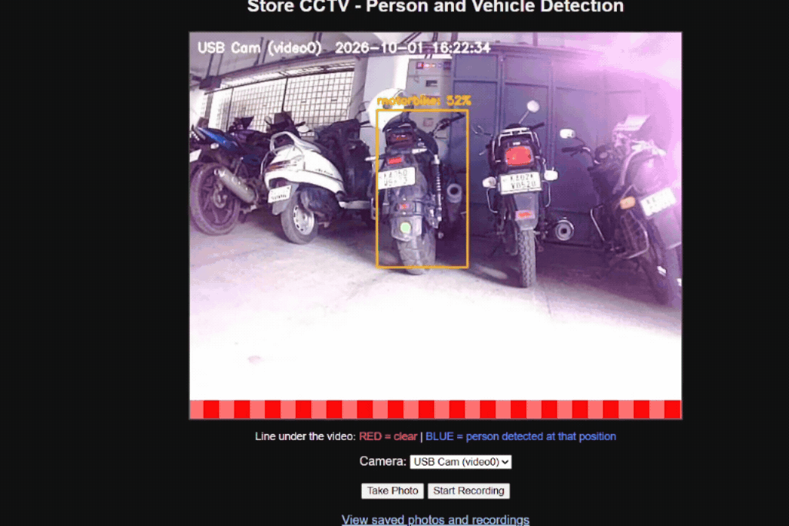

# RaspberryPi-Smart-CCTV

An automated multi-camera surveillance and object detection system built for the Raspberry Pi. This project implements localized object detection, live web management, snapshots, MP4 recording, and authenticated RTSP streaming without relying on external cloud APIs. Powered by a local MobileNet-SSD Caffe model, MediaMTX, and FFmpeg, the system runs completely headlessly on startup using systemd background services.

---

## Demo



---

## Features

* **Real-Time Local Edge Detection:** Detects persons, cars, buses, motorbikes, and bicycles on-device using a MobileNet-SSD Caffe model.
* **Multi-Camera Support:** Processes multiple USB webcam streams simultaneously (`/dev/video0` and `/dev/video2`) using threaded workers.
* **Dynamic Motion Visualizer:** Renders a dynamic bottom status strip that changes from red to blue across coordinates where a person is detected.
* **Automated & Manual Recording:**
  * **Auto Snapshots:** Automatically saves time-stamped images to disk when a person is detected (with a 10-second cooldown).
  * **Web Controls:** Manually trigger photos or toggle MP4 video clip recordings directly from the browser dashboard.
* **Dual-Protocol Streaming:**
  * **HTTP/MJPEG Dashboard:** Access live video feeds, camera switches, and file downloads over an authenticated web interface.
  * **RTSP Feeds:** Pushes low-latency H.264 video streams to MediaMTX via FFmpeg.
* **Zero-Terminal Boot Operation:** Configured with Linux `systemd` background services to run automatically on power-on without requiring SSH or manual terminal input.
* **Recordings Storage:** Snapshots and video clips are saved to `~/cctv/recordings/`, browsable and downloadable from the web dashboard's "View saved photos and recordings" page.

---

## Hardware Requirements

* **Raspberry Pi 3** (or newer, connected to external power supply)
* **2x USB Web Cameras** (for multi-angle capturing)
* **MicroSD Card** (with Raspberry Pi OS installed)
* **Laptop/PC** (for initial setup, viewing web feeds, or playing RTSP streams)

---

## Hardware Setup

1. Connect both USB cameras into the USB ports of the Raspberry Pi (`/dev/video0` and `/dev/video2`).
2. Position the cameras to cover the designated monitoring areas.
3. Ensure the Raspberry Pi is powered using a stable 5V power supply.
4. Connect the Pi to your local network or Wi-Fi hotspot.

---

## Software Setup

1. Install Raspberry Pi OS using the Raspberry Pi Imager.
2. Open the terminal on your Raspberry Pi and install the required dependencies:

```bash
sudo apt update
sudo apt install -y python3-opencv python3-flask python3-numpy ffmpeg
```

3. Download and set up MediaMTX:

```bash
cd ~
wget https://github.com/bluenviron/mediamtx/releases/download/v1.21.1/mediamtx_v1.21.1_linux_arm64.tar.gz
tar -xzf mediamtx_v1.21.1_linux_arm64.tar.gz
chmod +x ~/mediamtx
```

4. Download the MobileNet-SSD model files:

```bash
mkdir -p ~/cctv/models
cd ~/cctv/models
wget [fill in your verified prototxt URL] -O MobileNetSSD_deploy.prototxt
wget [fill in your verified caffemodel URL] -O MobileNetSSD_deploy.caffemodel
```

Verify both files downloaded correctly:

```bash
ls -lh ~/cctv/models/
```

Expected: `MobileNetSSD_deploy.prototxt` (~29 KB) and `MobileNetSSD_deploy.caffemodel` (~22-23 MB).

5. Configure MediaMTX RTSP authentication:
Edit `~/mediamtx.yml` and add the following settings near the top of the file:

```yaml
authMethod: internal

authInternalUsers:
  - user: <YOUR_RTSP_USERNAME>
    pass: <YOUR_RTSP_PASSWORD>
    ips: []
    permissions:
      - action: publish
        path:
      - action: read
        path:
      - action: playback
        path:
```

---

## Installation & Usage

1. Clone this repository directly into your home folder as `cctv`:

```bash
cd ~
git clone https://github.com/YOUR_GITHUB_USERNAME/RaspberryPi-Smart-CCTV.git cctv
```

This places the script at `~/cctv/SELF_BUILD_CCTV.py`, matching the path used in the systemd service below. (Model files from Software Setup step 4 should already be in `~/cctv/models/`.)

2. Edit parameters in `SELF_BUILD_CCTV.py` to set your credentials:

```python
PORT = 5000                          # Web interface port
AUTH_USERNAME = "<YOUR_WEB_USER>"    # Web login username
AUTH_PASSWORD = "<YOUR_WEB_PASS>"    # Web login password
RTSP_USERNAME = "<YOUR_RTSP_USER>"   # MediaMTX RTSP username
RTSP_PASSWORD = "<YOUR_RTSP_PASS>"   # MediaMTX RTSP password
```

**Important:** `RTSP_USERNAME`/`RTSP_PASSWORD` here must exactly match the `user`/`pass` values set in `~/mediamtx.yml` in Software Setup step 5, or the script will be unable to publish video to MediaMTX.

3. Run MediaMTX, then the script manually to test everything works before setting up auto-boot:

```bash
# Terminal 1 - start MediaMTX first
cd ~
./mediamtx

# Terminal 2 - then start the camera script
cd ~/cctv
python3 SELF_BUILD_CCTV.py 5000
```

Open `http://<your-pi-ip>:5000` in a browser to confirm the dashboard loads and prompts for login. Test an RTSP stream in VLC at `rtsp://<YOUR_RTSP_USER>:<YOUR_RTSP_PASS>@<your-pi-ip>:8554/stream1`.

4. Configure Auto-Boot (`systemd`):

Create `/etc/systemd/system/mediamtx.service`:

```ini
[Unit]
Description=MediaMTX RTSP Server
After=network-online.target
Wants=network-online.target

[Service]
User=<YOUR_PI_USER>
WorkingDirectory=/home/<YOUR_PI_USER>
ExecStart=/home/<YOUR_PI_USER>/mediamtx
Restart=always
RestartSec=5

[Install]
WantedBy=multi-user.target
```

Create `/etc/systemd/system/cctv.service`:

```ini
[Unit]
Description=CCTV Multi-Camera Detection and Web Server
After=network.target mediamtx.service
Requires=mediamtx.service

[Service]
Type=simple
User=<YOUR_PI_USER>
WorkingDirectory=/home/<YOUR_PI_USER>/cctv
ExecStart=/usr/bin/python3 /home/<YOUR_PI_USER>/cctv/SELF_BUILD_CCTV.py 5000
Restart=always
RestartSec=5

[Install]
WantedBy=multi-user.target
```

Enable both services:

```bash
sudo systemctl daemon-reload
sudo systemctl enable --now mediamtx
sudo systemctl enable --now cctv
```

Verify both are running:

```bash
sudo systemctl status mediamtx
sudo systemctl status cctv
```

Both should show `active (running)`.

---

## Troubleshooting

* **Model files missing error:** Verify that `MobileNetSSD_deploy.prototxt` and `MobileNetSSD_deploy.caffemodel` exist inside `~/cctv/models/` and have the expected file sizes (see Software Setup step 4).
* **Camera not found or failed to read frame:** Check USB connections with `ls /dev/video*`. Ensure `CAMERAS` source indices in the script match your connected USB video nodes (`/dev/video0`, `/dev/video2`).
* **RTSP stream fails to load in VLC:** Verify MediaMTX status with `sudo systemctl status mediamtx`. Ensure RTSP credentials in `SELF_BUILD_CCTV.py` match `~/mediamtx.yml` exactly. In VLC, enable "RTSP TCP mode" under Tools → Preferences → Input/Codecs → Demuxers → RTP/RTSP if the stream fails to open.
* **Web authentication failed:** Verify HTTP Basic Auth username and password entered in the browser match `AUTH_USERNAME` and `AUTH_PASSWORD` set in `SELF_BUILD_CCTV.py`.
* **Service crashes on boot:** Check live system logs using `sudo journalctl -u cctv.service -f` and `sudo journalctl -u mediamtx.service -f`.
* **Pi's IP address keeps changing:** This is normal when switching networks (DHCP assigns a new address each time). Run `hostname -I` on the Pi to get its current address.
* **Video feels laggy or frames are delayed in VLC:** Check VLC's network caching setting (Tools → Preferences → Input/Codecs → Demuxers → RTP/RTSP → Network caching), and confirm the Pi isn't under-voltage with `vcgencmd get_throttled` (expect `throttled=0x0`).

---

## Advantages & Limitations

| Advantages | Limitations |
| :--- | :--- |
| 100% local processing; no internet connection required | High CPU usage on Raspberry Pi during multi-stream detection |
| Zero API fees or usage limits | Frame rate limited to ~15 FPS for stability |
| Dual HTTP and RTSP streaming support | MobileNet-SSD accuracy depends on ambient lighting conditions |
| Automated headless startup on power-on | Requires physical USB connection for cameras |
| Built-in web dashboard for manual recording & snapshots | Storage capacity constrained by MicroSD card size |
| Compatible with VLC and RTSP-capable NVR software | No ONVIF support — auto-discovery by NVR software not supported; manual RTSP URL entry only |
